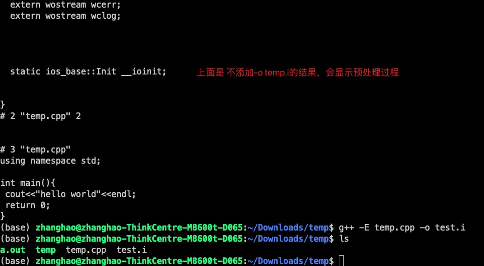

# 零 四步走

## 将test.cpp **预处理** 、**汇编**、**编译** 、 **链接**形成最终的可执行文件。

预处理由.cpp 生成 .i文件

编译由 .i 文件 生成 .s文件

汇编由 .s 文件 生成 .o文件

链接由 .o文件 生成 a.out可执行的二进制文件


传统意义上的编译程序分两步走 —— 编译和链接：

## 1.编译(compile)：

编译是指用编译器(compiler)将源代码(source code)生成二进制目标文件(object file)，在Windows下也就是 .obj 文件，UNIX下是 .o 文件。编译时，编译器需要的是语法的正确，函数与变量的声明的正确，编译器只检测程序语法，和函数、变量是否被声明，函数并不需要被定义。

  UNIX下g++的语法为:
  ```bash
    g++ -c file.cpp
  ```

  -c 是compile的意思，此命令将会生成 file.o 的目标文件。


## 2.链接(link)：

链接是指找到所要用到函数所在的目标文件，并把它们链接在一起合成为可执行文件(executable file)。链接时，要确保编译器能找到所有被用到了的函数所在的目标文件。

  ```bash
  g++ file1.o file2.o -o program.exe
  ```

  -o 是指定生成的可执行文件名称(output)。若不给出，默认的名称为 a.out


上述两部通常也可以合在一起完成：

 ```bash
  g++ file1.cpp file2.cpp -o program.exe
 ```

这完全等同于上面两步的结合，会先生成目标文件，然后链接成 file.exe


## 3.在编译时链接库

创建了自己的库，以后要用到相关函数的时候，只需在代码中声明所要用的函数（必须和库中定义得相同）。在链接的时候，需要给出库的名称和位置：

```bash
g++ file1.o file2.o -o program.exe -L**** -l****
```

-L 后紧跟库文件所在的目录地址，-l 后紧跟库名。

编译器在链接的时候会在所指定的目录地址下寻找名为 lib****.a 的库文件。

# 一 单个源程序

## 1 无选项的编译链接

```bash
g++ temp.cpp #默认输出a.out
```


## 2 选项-o（一步到位，包含四个步骤）

```bash
g++ temp.cpp -o temp #-o用于指定输出文件名
```


将test.cpp预处理、汇编、编译、链接 形成可执行文件。

## 3 选项-E (预处理步骤)

```bash
g++ -E temp.cpp #显示终端生出过程，不生成test.i文件
```
```bash
g++ -E temp.cpp -o temp.i #不显示终端生成过程，直接生成预处理后的.i文件
```



## 4 选项 -S (编译阶段)

```bash
g++ -S test.i #将预处理输出的文件test.i汇编成test.s文件，效果与g++ -S test.i -o test.s相同。
```

```bash
g++ -S test.i -o test.s#效果同上
```


## 5 选项 -c （汇编阶段）

**ps：**因为这个命令有个`-c`，我老是把有`-c`命令的阶段当成编译阶段。头痛。。。。。


```bash
g++ -c test.s#将汇编生成的test.s文件编译输出为test.o文件，效果与g++ -c test.s -o test.o相同。
```


```bash
g++ -c test.s -o test.o#效果同上
```


## 6 无选项链接
```bash 
g++ test.o -o test #将编译输出文件test.o链接成最终可执行文件test。
```


## 7 选项-O
```bash 
g++ -O1 test.c -o test
```

使用编译优化级别1编译程序。级别为1~3，级别越大优化效果越好，但编译时间越长。

# 二 多源程序

假设有两个源文件为test.c和testfun.c

## 1 多个文件一起编译
```bash
g++ testfun.c test.c -o test
```

作用：将testfun.c和test.c分别编译后链接成test可执行文件。

假设我们有个目录/usr,在/usr中分别存有两个目录/proone和/protwo。我们把源程序*.cpp放在/proone中，把头文件放在/protwo中。现在我们执行g++ a.cpp b.cpp -o abc后终端会显示头文件出错，即找不到头文件。这时我们应该执行g++ a.cpp b.cpp -I../protwo -o abc。参数-I是确定头文件的路径。若是/protwo和/usr在同一目录下，即头文件目录比目标源程序高两个等级，则相应的-I../protwo要变为-I../../protwo。

## 2 分别编译各个源文件，之后对编译后输出的目标文件链接。

```bash
gcc -c testfun.c //将testfun.c编译成testfun.o
gcc -c test.c //将test.c编译成test.o
gcc testfun.o test.o -o test //将testfun.o和test.o链接成test
```


以上两种方法相比较，第一种方法编译时需要所有文件重新编译，而第二种方法可以只重新编译修改的文件，未修改的文件不用重新编译。


# 三 g++入门教程

2018-08-03阅读 9.7K0

## 1.g++简介

g++是GNU开发的C++编译器，是GCC（GNU Compiler Collection）GNU编译器套件的组成部分。另外，gcc是GNU的C编译器。

看官方手册你会发现g++的命令选项真的多如繁星，令人头皮发麻。但是常用的命令选项也就那几个，完成我们的日常编译，g++使用起来还是比较简单的！

g++编译器是GCC的一部分，GCC编译工作一般分为四个步骤：  （1）预处理（Preprocessing）。由预处理器cpp完成，将.cpp源文件预处理为.i文件。

```javascript
g++  -E  test.cpp  -o  test.i    //生成预处理后的.i文件
```

复制

（2）编译（Compilation）。将.i文件编译为.s的汇编文件。使用`-S`选项，只进行编译而不进行汇编，生成汇编代码。这里的编译器具体是什么，我暂时还不清楚，知道的请留言告知，万分感谢。百度百科说是egcs，但是我在Linux并没有查到该命令。

```javascript
g++ -S test.i -o test.s         //生成汇编.s文件
```

复制

（3）汇编（Assembly）。由汇编器as完成，将.s文件汇编成.o的二进制目标文件。

```javascript
g++  -c  test.s  -o  test.o    //生成二进制.o文件
```

复制

（4）链接（Linking）。由链接器ld，将.o文件连接生成可执行程序。

```javascript
g++ test.o  -o  test.out      //生成二进制.out可执行文件 
```

复制

## 2.命令格式

```javascript
gcc [-c|-S|-E] [-std=standard]
    [-g] [-pg] [-Olevel]
    [-Wwarn...] [-pedantic]
    [-Idir...] [-Ldir...]
    [-Dmacro[=defn]...] [-Umacro]
    [-foption...] [-mmachine-option...]
    [-o outfile] [@file] infile...
```

复制

## 3.命令选项

关于g++的命令选项，大家可以参考[g++百度百科](http://baike.baidu.com/link?url=FQvGegKMC9UsRPbdBRSRkto7y-QJuy093kei3dqlVwzghhwZv_i3nD53Xtq16n4_26phqLxD4DKCqnXSQ17Az_)或者[GCC官方手册](https://gcc.gnu.org/onlinedocs/gcc-6.1.0/gcc.pdf)，或者使用`man g++`单独查看g++使用手册。

下面列出常用的命令选项。

**（1）总体选项**

```javascript
-E
    只激活预处理,这个不生成文件,你需要把它重定向到一个输出文件里面。例子用法:   
    gcc -E hello.c > pianoapan.txt   
    gcc -E hello.c | more   
    慢慢看吧,一句`hello word`也要预处理成800行的代码。     
-S   
    只激活预处理和编译，就是指把文件编译成为汇编代码。例子用法： 
    gcc -S hello.c   
    将生成.s的汇编代码，可以用文本编辑器查看。    
-c    
    只激活预处理,编译,和汇编,也就是他只把程序做成obj文件。例子用法:   
    gcc -c hello.c   
    将生成.o的目标文件（object file）。 
-o
    指定目标名称，缺省的时候，gcc/g++编译出来的文件是a.out。例子如下：   
    g++ -o hello.out hello.cpp
    g++ -o hello.asm -S hello.cpp   
```

复制

**（2）目录选项**

```javascript
-I[dir]
    在你是用#include "file"的时候，gcc/g++会先在当前目录查找你所指定的头文件，如果没有找到，会到系统默认的头文件目录找。如果使用-I指定了目录，编译器会先在指定的目录查找，然后再去系统默认头文件目录查找。对于#include <file>，gcc/g++会到-I指定的目录查找，查找不到，然后再到系统默认的头文件目录查找。
-include [file]
    相当于“#include”，用于包含某个代码,简单来说,就是编译某个文件,需要另一个文件的时候,就可以   
    用它设定,功能就相当于在代码中使用#include。例子用法:   
    gcc hello.c -include /root/pianopan.h   
-I-
    就是取消前一个参数的功能,所以一般在-Idir之后使用   
-idirafter [dir]   
    在-I的目录里面查找失败，将到目录dir里面查找。
-iprefix [prefix]，-iwithprefix [dir]
    一般一起使用，当-I的目录查找失败，会到prefix+dir下查找。
-L[dir]   
    编译的时候，指定搜索库的路径。比如你自己的库，可以用它指定目录，不然编译器将只在标准库的
    目录找。这个dir就是目录的名称。
-l[library]    
    指定编译的时使用的库，例子用法   
    gcc -lcurses hello.c   
    使用curses库编译连接，生成程序。  
```

复制

**（3）预处理选项**

```javascript
-Dmacro
    相当于C语言中的#define macro。
-Dmacro=defn   
    相当于C语言中的#define macro=defn。
-Umacro
    相当于C语言中的#undef macro。
-undef
    取消对任何非标准宏的定义。
```

复制

**（4）链接方式选项**

```javascript
-static
    此选项将禁止使用动态库。优点：程序运行不依赖于其他库。缺点：可执行文件比较大。
-shared
    此选项将尽量使用动态库，为默认选项。优点：生成文件比较小。缺点：运行时需要系统提供动态库。
-symbolic
    建立共享目标文件的时候，把引用绑定到全局符号上。对所有无法解析的引用作出警告（除非用连接选项，
    '-Xlinker -z -Xlinker defs'取代)。注：只有部分系统支持该选项。
-Wl,-Bstatic
    告诉链接器ld只链接静态库，如果只存在动态链接库，则链接器报错。
-Wl,-Bdynamic
    告诉链接器ld优先使用动态链接库，如果只存在静态链接库，则使用静态链接库。
```

复制

**（5）错误与告警选项**

```javascript
-Wall
    一般使用该选项，允许发出GCC能够提供的所有有用的警告。也可以用-W{warning}来标记指定的警告。
-pedantic
    允许发出ANSI/ISO C标准所列出的所有警告。
-pedantic-errors
    允许发出ANSI/ISO C标准所列出的错误
-werror
    把所有警告转换为错误，在警告发生时中止编译过程。
-w
    关闭所有警告,建议不要使用此项。
```

复制

**（6）调试选项**

```javascript
 -g   
    指示编译器，在编译时，产生调试信息。
-gstabs   
    此选项以stabs格式生成调试信息,但不包括gdb调试信息。 
-gstabs+   
    此选项以stabs格式声称调试信息,并且包含仅供gdb使用的额外调试信息.   
-ggdb    
    此选项将尽可能的生成gdb可以使用的调试信息。
-glevel
    请求生成调试信息，同时用level指出需要多少信息，默认的level值是2。
```

复制

**（7）优化选项**

```javascript
-O0   
-O1   
-O2   
-O3   
    编译器优化选项分为4个级别，-O0表示没有优化，-O1为缺省值，建议使用-O2，-O3优化级别最高。
```

复制

**（8）其他选项**

```javascript
-fpic
    编译器就生成位置无关目标码.适用于共享库(shared library).
-fPIC
    编译器就输出位置无关目标码.适用于动态连接(dynamic linking),即使分支需要大范围转移。
-v 显示详细的编译、汇编、连接命令
-pipe
    使用管道代替编译过程中的临时文件,在使用非gnu汇编工具的时候,可能有些问题   
    g++ -pipe -o hello.out hello.cpp
-ansi
    关闭gnu c中与ansi c不兼容的特性，激活ansi c的专有特性(包括禁止一些asm inline typeof关键字,以及
    UNIX,vax等预处理宏。
-fno-asm   
    此选项实现ansi选项功能的一部分，它禁止将asm,inline和typeof用作关键字。   
-fno-strict-prototype
    只对g++起作用,使用这个选项,g++将对不带参数的函数,都认为是没有显式的对参数的个数和类型说明,而不是没有
    参数.而gcc无论是否使用这个参数,都将对没有带参数的函数,认为没有显式说明的类型。
-fthis-is-varialble   
    就是向传统c++看齐,可以使用this当一般变量使用。
-fcond-mismatch   
    允许条件表达式的第二和第三参数类型不匹配,表达式的值将为void类型。
-funsigned-char   
-fno-signed-char   
-fsigned-char   
-fno-unsigned-char   
    这四个参数是对char类型进行设置,决定将char类型设置成unsigned char(前两个参数)或者signed char(后
    两个参数)。
-imacros file   
    将file文件的宏,扩展到gcc/g++的输入文件,宏定义本身并不出现在输入文件中     
-nostdinc   
    使编译器不在系统缺省的头文件目录里面找头文件,一般和-I联合使用,明确限定头文件的位置。 
-nostdin C++
    规定不在g++指定的标准路经中搜索,但仍在其他路径中搜索,此选项在创建libg++库使用。
-C
    在预处理的时候,不删除注释信息,一般和-E使用,有时候分析程序，用这个很方便的。 
-M  
    生成文件依赖的信息，包含目标文件所依赖的所有源文件。你可以用gcc -M hello.c来测试一下，很简单。   
-MM   
    和上面的那个一样，但是它将忽略由#include造成的依赖关系。   
-MD
    和-M相同，但是输出将导入到.d的文件里面。
-MMD   
    和-MM相同，但是输出将导入到.d的文件里面。
-Wa,option   
    此选项传递option给汇编程序；如果option中间有逗号,就将option分成多个选项，然后传递给会汇编程序。 
-Wl.option   
    此选项传递option给连接程序;如果option中间有逗号,就将option分成多个选项,然后传递给会连接程序。
-x language filename   
    设定文件所使用的语言,使后缀名无效,对以后的多个有效.也就是根据约定C语言的后缀名称是.c的，而C++的后缀
    名是.C或者.cpp。如果你很个性，决定你的C代码文件的后缀名是.pig，那你就要用这个参数,这个参数对他后面
    的文件名都起作用，除非到了下一个参数的使用。可以使用的参数有下面的这些：
    c,objective-c,c-header,c++,cpp-output,assembler,assembler-with-cpp。   
    看到英文，应该可以理解的。例子用法:   
    gcc -x c hello.pig
-x none filename
    关掉上一个选项，也就是让gcc根据文件名后缀，自动识别文件类型，例子用法:   
    gcc -x c hello.pig -x none hello2.c
```

复制

## 4.FAQ

### 4.1编译选项疑问

#### 4.1.1-Wno-unknown-pragmas和-Wno-format -pg

**-Wno-unknown-pragmas：**查了大量资料和官方的手册，我觉得这个应该是实验室的师兄写错了，貌似没有这个警告命令选项。官方手册中有如下两个设置警告的命令选项。

**（1）-Wunknown-pragmas**

```javascript
Warn when a #pragma directive is encountered that is not understood by GCC. If this 
command-line option is used, warnings are even issued for unknown pragmas in system 
header files. This is not the case if the warnings are only enabled by the ‘-Wall’ 
command-line option.
```

复制

遇到GCC无法识别的编译指导指令，发出警告。在使用了-Wall选项时，就不需要使用该命令选项了。

**（2）-Wno-pragmas**

```javascript
Do not warn about misuses of pragmas, such as incorrect parameters, invalid
syntax, or conflicts between pragmas. See also '-Wunknown-pragmas'.
```

复制

遇到GCC无法识别的编译指导指令，不发出警告。

**-pg作用：**编译的过程中加入额外的代码， 供性能分析工具gprof剖析程序的耗时情况。

### 4.2链接注意事项

#### 4.2.1指定静态与动态的链接方式

g++链接库时，默认优先链接动态链接库。静态库与动态库混合链接时，有如下两种方法：  （1）静态链接库使用绝对路径，动态链接库使用-l。以boost库为例，如果我们要使用静态库则可书写如下：

```javascript
 g++ main.cpp -pthread /usr/lib64/libboost_thread.a /usr/lib64/libboost_system.a
```

复制

（2）使用`-Wl,-Bstatic`告诉链接器`ld`链接静态库，不存在静态库，则`ld`报错，只存在动态链接库也报错。使用`-Wl,-Bdynamic`告诉链接器**优先**使用动态链接库，如果只存在静态库，则链接静态库，不报错。示例如下：

```javascript
g++  main.cpp -Wl,-Bstatic -lboost_system -lboost_thread -Wl,-Bdynamic
```

复制

**注意：**  （1）命令末尾`-Wl,-Bdynamic`，作用是告诉链接器，后续系统库的链接默认使用动态链接，否则会出现找不到系统库的错误，诸如：

```javascript
/usr/bin/ld: cannot find -lgcc_s
collect2: ld returned 1 exit status
```

复制

（2）链接时，库要放在目标文件的后面，否则会报”undefined reference to: xxx”错误。具体参见gcc手册的如下描述：

```javascript
the linker searches and processes libraries and object files in the order they are 
specified. Thus, `foo.o -lz bar.o' searches library `z' after file foo.o but before 
bar.o. If bar.o refers to functions in `z', those functions may not be loaded.
```

复制

------

## 参考文献

[1][gcc及其选项详解](http://blog.chinaunix.net/uid-25119314-id-224398.html) 

 [2][GCC官方手册](https://gcc.gnu.org/onlinedocs/gcc-6.1.0/gcc.pdf) 

 [3][gcc编译选项](http://www.cnblogs.com/fengbeihong/p/3641384.html)

  [4][gcc/g++ 静态动态库混链接](http://blog.csdn.net/wangxvfeng101/article/details/15336955) 

 [5][折腾gcc/g++链接时.o文件及库的顺序问题](http://blog.csdn.net/imilli/article/details/51454236) 

 [6][g++参数介绍](http://www.cnblogs.com/lidan/archive/2011/05/25/2239517.html)  

[7][gcc cannot find cc1plus](https://stackoverflow.com/questions/36353302/gcc-cannot-find-cc1plus?utm_medium=organic&utm_source=google_rich_qa&utm_campaign=google_rich_qa)